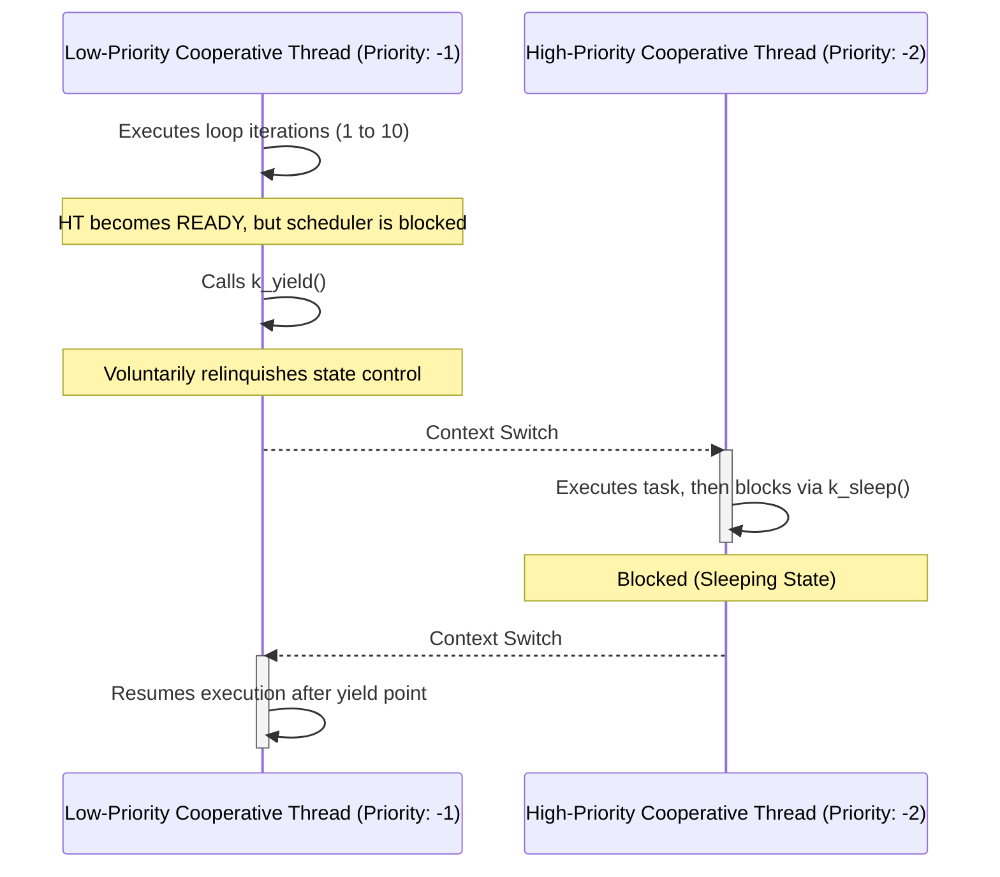
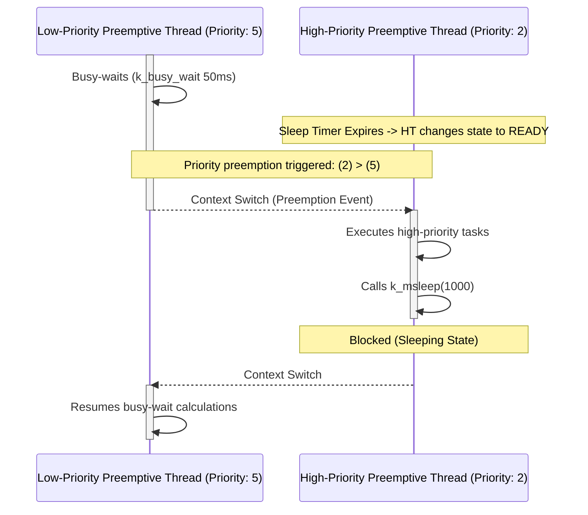

# Zephyr RTOS Project Hub: Portable Firmware & Kernel Demonstrations

[](LICENSE)
[](https://docs.zephyrproject.org/latest/introduction/index.html)
[](#-portability--microchip-target-alignment)
[](#-device-tree-hardware-abstraction)
[](https://en.cppreference.com/w/c/11)

Welcome to the **Zephyr RTOS Demonstration Hub**. This repository showcases a structured, production-oriented approach to firmware development using the Zephyr Real-Time Operating System. 

It is designed to demonstrate key RTOS concepts—ranging from hardware-independent peripheral interfacing (DeviceTree & Kconfig) to core kernel scheduling models (Cooperative vs. Preemptive multitasking) and the modern asynchronous **RTIO** sub-system.

---

## 📂 Repository Architecture

The repository is modularized to separate basic hardware-abstraction layers (HAL) from core kernel diagnostics:

```text
zephyr-rtos-projects/
├── getting_started/
│   ├── blinky/               # GPIO output validation using DeviceTree bindings
│   └── accel_polling/        # Multi-sensor polling (Sensor API) supporting:
│                             #   - Traditional synchronous polling
│                             #   - Next-gen RTIO Async Sensor API (CONFIG_SENSOR_ASYNC_API)
│
└── kernel_api/
    ├── 01_threads/           # Static thread creation (K_THREAD_DEFINE) & DeviceTree overlays
    └── 02_thread_scheduling/ # Execution timing control logic
        ├── cooperative/      # Yielding & negative priorities (-1, -2) block demos
        └── preemptive/       # Busy-waiting & positive priorities (2, 5) preempt rules
```

> [!NOTE]
> Every sub-directory is configured as a standalone Zephyr application containing its own `CMakeLists.txt`, `prj.conf` Kconfig file, and hardware overlays.

---

## 💡 Key Technical Highlights for the Microchip Zephyr Team

This codebase is structured around production-grade Zephyr paradigms that make it highly appealing for hardware development teams:

### 1. Zero-Code Portability (DeviceTree & Kconfig Separation)
Rather than hardcoding GPIO or peripheral registers inside the C source code, all hardware resources are queried dynamically from the compiled DeviceTree node identifiers. Moving from one microcontroller architecture to another (e.g., STM32 to Microchip SAM) requires **zero modifications** to the C source files.

### 2. Modern RTIO & Async Sensor API Implementation
In the `getting_started/accel_polling` application, the firmware is engineered to support the next-generation **Zephyr RTIO (Real-Time I/O)** framework. By configuring `CONFIG_SENSOR_ASYNC_API=y`, the code is capable of bypassing CPU-blocking polling loops, leveraging memory pool buffers, and running highly efficient DMA-assisted sensor streams.

---

## 🔌 Hardware Abstraction: Microchip Target Alignment

To prove the platform-agnostic design, the following configuration details demonstrate how this workspace can be mapped to Microchip hardware.

### STM32 Nucleo-F411RE Mapping (Default Target)
*   **Onboard User LED (`led0`)**: Pin `PA5`
*   **Debug External LED (`led1`)**: Pin `PA9` (configured via `app.overlay`)
*   **I2C2 SCL / SDA**: Pins `PB10` / `PB3`
*   **Serial Terminal Console**: ST-LINK Virtual COM (UART2) at `115200 8N1`

### Porting to Microchip SAM E70 (ATSAME70Q21)
To deploy these same applications onto the **Microchip SAM E70 Xplained** board, you only need to supply a target-specific DeviceTree overlay (`sam_e70_xplained.overlay`).

Below is a representative overlay snippet showing how the hardware aliases route transparently to Microchip PIO Controllers and TWIHS peripherals:

```dts
/ {
    aliases {
        led0 = &green_led;      /* Onboard Yellow/Green LED on SAM E70 */
        led1 = &ext_debug_led;  /* External LED connected to Pin PA9 */
        accel0 = &adxl345_twi;  /* I2C-based Accelerometer mapped to TWIHS0 */
    };

    leds {
        compatible = "gpio-leds";
        ext_debug_led: led_1 {
            gpios = <&pioa 9 (GPIO_ACTIVE_HIGH | GPIO_PULL_UP)>;
            label = "External Board Debug LED";
        };
    };
};

&twihs0 {
    status = "okay";
    clock-frequency = <I2C_BITRATE_FAST>; /* 400kHz */

    adxl345_twi: adxl345@53 {
        compatible = "adi,adxl345";
        reg = <0x53>;
        status = "okay";
    };
};
```
*No modifications are required in `main.c`—Zephyr's build system links the unified C APIs (`gpio_pin_toggle_dt`, `sensor_channel_get`) to the underlying Microchip PIO/TWIHS drivers automatically.*

---

## 📊 Kernel Scheduling Diagnostics & Flowcharts

The scheduling module (`kernel_api/02_thread_scheduling`) illustrates the exact behavioral differences in Zephyr's scheduler types:

### A. Cooperative Scheduling (`priority: -1` vs `-2`)
Cooperative threads (negative priorities) are run-to-completion tasks. A lower-priority cooperative thread (`-1`) retains CPU ownership indefinitely—even when a higher-priority thread (`-2`) is marked `READY`—until it explicitly yields CPU control.



### B. Preemptive Scheduling (`priority: 5` vs `2`)
Preemptive threads (positive priorities) are time-sliced and rank-prioritized. The moment a higher-priority preemptive thread (`2`) exits a blocked state, the scheduler instantly interrupts the lower-priority thread (`5`).



---

## ⚙️ Compilation & Flashing Guide

Zephyr projects in this repository are managed using the standard meta-tool `west`.

### 1. Initialize Zephyr Workspace (First-Time Setup)
```bash
# Create and initialize the workspace directory
west init ~/zephyrproject
cd ~/zephyrproject && west update
west zephyr-export

# Install python modules & cross-compilers
pip install -r ~/zephyrproject/zephyr/scripts/requirements.txt
```

### 2. Multi-Platform Build Command Examples
To compile any project, run `west build` from the repository root, pointing to your desired target board:

```bash
# Build Blinky for default STM32 Nucleo
west build -p always -b nucleo_f411re getting_started/blinky

# Build Blinky for Microchip SAM E70 Xplained
west build -p always -b sam_e70_xplained getting_started/blinky

# Build Cooperative Scheduling Demo
west build -p always -b nucleo_f411re kernel_api/02_thread_scheduling/cooperative_thread
```

### 3. Flash Code to Hardware
Connect your development board (via ST-LINK or SAM-ICE debuggers) and run:
```bash
west flash
```

### 4. Serial Debug Interface Connection
Connect a terminal client configuration for **115200 Baud, 8-N-1** to observe log dumps (`printk`):

```bash
# Linux/macOS (Picocom example)
picocom -b 115200 /dev/ttyACM0

# Windows (PowerShell Plink example)
plink -serial COM3 -sercfg 115200,8,n,1,N
```

---

## 📈 Module Verification Status & Roadmap

The hub is organized as a progressive learning system. Below is the feature implementation status:

- [x] **Peripheral Basics**: GPIO Output control (`getting_started/blinky`)
- [x] **Multi-Sensor I2C Interfaces**: Multi-instance reading using DeviceTree aliases and Sensor API APIs (`getting_started/accel_polling`)
- [x] **Thread Operations**: Compiler-time static thread definition via `K_THREAD_DEFINE` (`kernel_api/01_threads`)
- [x] **Cooperative Execution Model**: Yield scheduling validation (`kernel_api/02_thread_scheduling/cooperative_thread`)
- [x] **Preemptive Execution Model**: Automatic runtime preemption (`kernel_api/02_thread_scheduling/preemptive_demo`)
- [ ] **Data Transport**: Mutex/Semaphore execution guarantees and message FIFO/LIFO queues *(In Progress)*
- [ ] **Timers & Offloading**: Hardware core timers and system workqueues *(Planned)*
- [ ] **Low-Power States**: Configuring system sleep settings and clock gated modes *(Planned)*

---

## 🎓 References & Design Docs
*   [Zephyr Project Hardware Abstraction Guide](https://docs.zephyrproject.org/latest/hardware/index.html)
*   [DeviceTree Specification & Bindings](https://docs.zephyrproject.org/latest/build/dts/index.html)
*   [Zephyr Kernel Services Architecture](https://docs.zephyrproject.org/latest/kernel/services/index.html)
*   [Microchip SAM E70 MCU Product Details](https://www.microchip.com/en-us/product/ATSAME70Q21)

---

## 👤 Author Contact & License
*   **Developer**: **Priya Dharshini S** (ECE Department / Firmware Engineering)
*   **Focus**: Embedded Systems | Real-Time Architectures (Zephyr RTOS) | Silicon Portability | C/C++
*   **GitHub**: [@PriyaSelvakumar123](https://github.com/PriyaSelvakumar123)
*   **License**: This project is licensed under the [MIT License](LICENSE).
