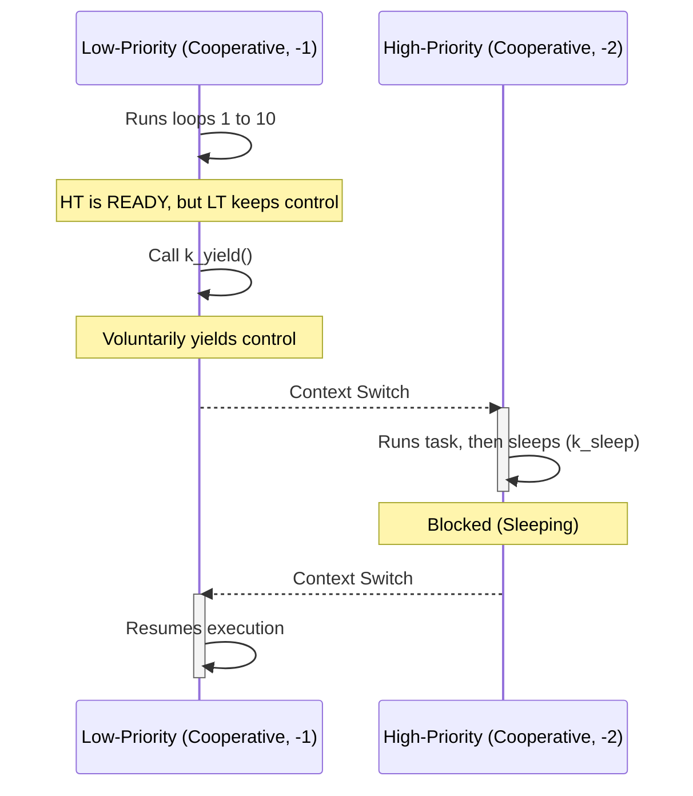
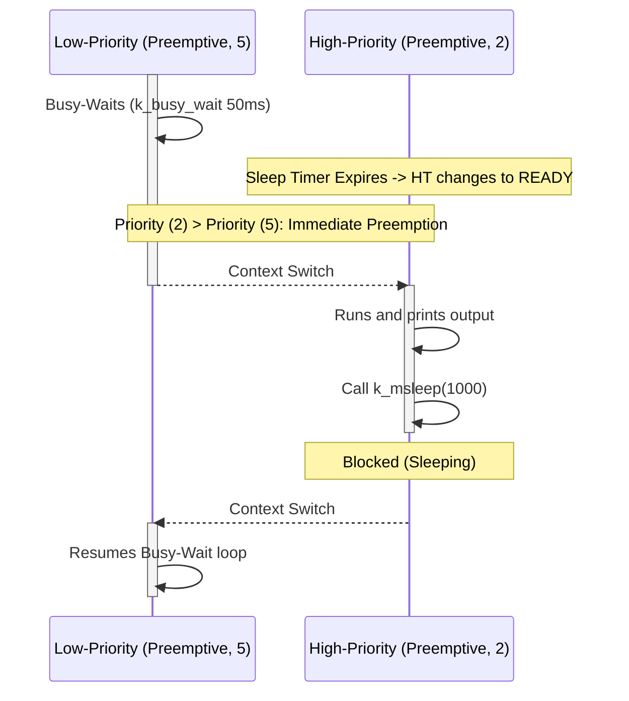

# Zephyr RTOS Projects


A clean, structured collection of **Zephyr RTOS** examples for the **STM32 Nucleo-F411RE** board. This repository is designed as a progressive learning guide—scaling from basic hardware access (GPIO, Sensors) to RTOS kernel internals (Threads, Cooperative/Preemptive scheduling).

---

## 📂 Project Structure

```text
zephyr-rtos-projects/
├── getting_started/
│   ├── blinky/               # Basic GPIO LED control
│   └── accel_polling/        # Multi-sensor polling (Sensor API)
│
├── kernel_api/
│   ├── 01_threads/           # Static thread creation & DeviceTree overlays
│   └── 02_thread_scheduling/ # Scheduling behavioral demos
│       ├── cooperative/      # Yielding & negative priorities (-1, -2)
│       └── preemptive/       # Busy-waiting & positive priorities (2, 5)
```

> [!NOTE]
> Every folder is a fully self-contained Zephyr application with its own `CMakeLists.txt`, `prj.conf`, and `src/main.c`.

---

## 🛠️ Modules Overview

### 1. Getting Started
*   **Blinky**: Toggles the onboard green LED (`led0`). Demonstrates basics of GPIO configuration and DeviceTree bindings.
*   **Accelerometer Polling**: Reads X, Y, and Z acceleration. Uses the Zephyr **Sensor API** and maps up to 10 sensors via DeviceTree aliases (`accel0` to `accel9`).

### 2. Threads (`01_threads`)
*   **Concepts**: Creating threads statically at compile-time via `K_THREAD_DEFINE`.
*   **Hardware Setup**: Toggles the onboard LED (`led0` / `PA5`) and an external LED (`led1` / `PA9`) configured using `app.overlay`.
*   **Priority Rules**: Thread 0 (Priority `3`) executes before Thread 1 (Priority `5`).
    > [!IMPORTANT]
    > In Zephyr, **lower priority numbers = higher execution priority**.

### 3. Scheduling (`02_thread_scheduling`)

| Scheduling Type | Priority Range | Context Switch Trigger | Behavior Description |
| :--- | :--- | :--- | :--- |
| **Cooperative** | Negative (`-1` to `-15`) | `k_yield()`, `k_sleep()`, or blocking I/O | Keeps hold of the CPU until the running thread voluntarily yields. |
| **Preemptive** | Positive (`0` to `15`) | Time-slice end, thread sleep, or priority change | Scheduler instantly preempts the running thread when a higher-priority task is ready. |

---

## 📊 Scheduling Flowcharts

### Cooperative Scheduling (`priority: -1` vs `-2`)
A cooperative thread retains CPU control even if a higher-priority cooperative thread becomes ready.



### Preemptive Scheduling (`priority: 5` vs `2`)
A preemptive thread is immediately interrupted matching the CPU scheduler's priority rules.



---

## 🔌 Hardware & Pin Configuration

These configurations apply directly to the **STM32 Nucleo-F411RE**:

*   **Onboard Green LED**: Pin `PA5` (mapped to `led0`)
*   **External Debug LED**: Pin `PA9` (mapped to `led1` via `app.overlay`)
*   **I2C2 Clock (SCL)**: Pin `PB10`
*   **I2C2 Data (SDA)**: Pin `PB3`
*   **Console Logging**: ST-LINK Virtual COM port (UART2, `PA2`/`PA3`) at **115200 Baud**

---

## ⚡ Setup & Build Guide

### 1. Prerequisite Command Commands
Ensure your terminal environment is configured:
```bash
# Initialize & sync the Zephyr Workspace
west init ~/zephyrproject
cd ~/zephyrproject && west update
west zephyr-export

# Register python dependencies
pip install -r ~/zephyrproject/zephyr/scripts/requirements.txt
```

### 2. Build the Applications
Navigate to the root directory of this repository, then specify the target project folder:

```bash
# General Syntax: west build -p always -b nucleo_f411re <project_path>

# Example: Build the Threads demo
west build -p always -b nucleo_f411re kernel_api/01_threads
```

### 3. Flash to Board
Connect your Nucleo-F411RE board to your PC via USB and upload:
```bash
west flash
```

### 4. Connect to Console
View debug logs (`printk`) in a serial monitor configured for **115200 baud**:

```bash
# Using Minicom (Linux)
minicom -D /dev/ttyACM0 -b 115200

# Using Picocom (Linux)
picocom -b 115200 /dev/ttyACM0
```

---

## 📈 Roadmap & Completion Progress

- [x] **Getting Started**: GPIO Blinky & Sensor API Accelerometer Polling
- [x] **Kernel API (Threads)**: Thread creation via `K_THREAD_DEFINE`
- [x] **Kernel API (Scheduling)**: Cooperative vs. Preemptive behavior
- [ ] **Kernel API (Synchronization)**: Semaphores, Mutexes, and Data Queues *(In Progress)*
- [ ] **Kernel API (Timers)**: Hardware Timers & System Workqueues *(Planned)*
- [ ] **Peripherals**: PWM Output & Analog-to-Digital Conversion (ADC) *(Planned)*
- [ ] **Interfaces**: Detailed drivers (SPI, UART, custom I2C overlay configs) *(Planned)*

---

## 📜 References
*   [Zephyr Project Documentation](https://docs.zephyrproject.org/latest/introduction/index.html)
*   [STM32 Nucleo-F411RE Hardware Details](https://docs.zephyrproject.org/latest/boards/arm/nucleo_f411re/doc/index.html)
*   [Zephyr Scheduling Internals Guide](https://docs.zephyrproject.org/latest/kernel/services/scheduling/index.html)

---

## 👥 Author & License

*   **Author**: **Priya Dharshini S** (ECE Department)
*   **Focus**: Embedded Systems | Firmware Engineering | Zephyr RTOS | STM32 | C
*   **Github**: [@PriyaSelvakumar123](https://github.com/PriyaSelvakumar123)
*   **License**: Licensed under the [MIT License](LICENSE).
