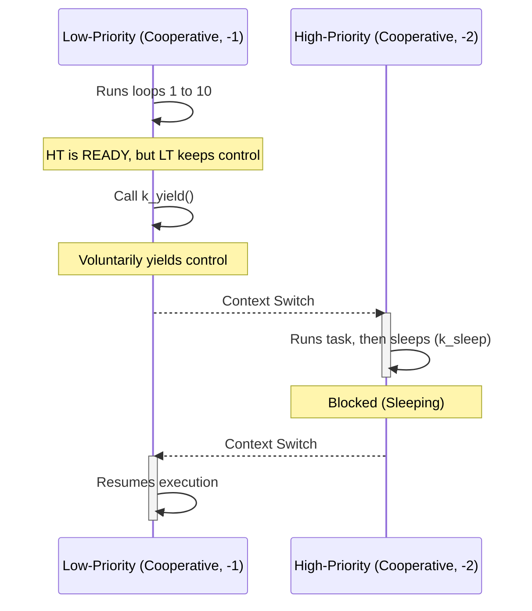
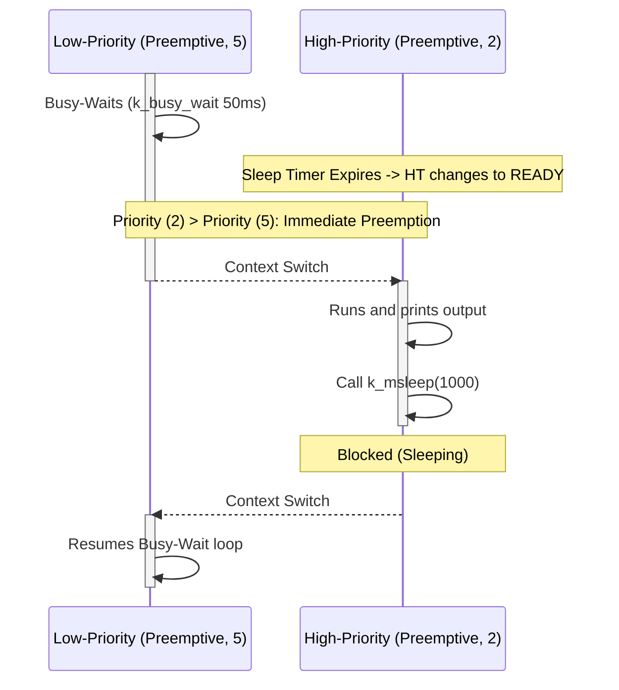

# Zephyr RTOS Projects: STM32 Firmware Sandbox

[](https://docs.zephyrproject.org/latest/)
[](https://www.st.com/en/microcontrollers-microprocessors/stm32f411re.html)
[](https://docs.zephyrproject.org/latest/boards/stm32/nucleo_f411re/doc/index.html)
[](https://en.cppreference.com/w/c/11)
[](LICENSE)

A clean, production-grade collection of **Zephyr RTOS** application firmware modules targeted for the **STM32 Nucleo-F411RE** board. This repository is structured as an incremental, learning-oriented sandbox—scaling from basic hardware peripheral interaction via **DeviceTree overlays** and drivers to advanced **kernel-level multitasking, cooperative, and preemptive thread scheduling**.

---

## 📂 Project Architecture

This repository uses Zephyr's standard out-of-tree application structure, where every module is an isolated, independent build target:

```text
zephyr-rtos-projects/
├── getting_started/
│   ├── README.md               # Getting Started introductory documentation
│   ├── blinky/                 # GPIO LED flashing and polling
│   └── accel_polling/          # Multi-sensor polling (Sensor API)
│
└── kernel_api/
    ├── 01_threads/             # Static thread creation (K_THREAD_DEFINE) and app.overlay
    └── 02_thread_scheduling/   # Behavioral analysis of the Zephyr Scheduler
        ├── README.md           # Scheduling overview & documentation
        ├── cooperative_thread/ # Yielding, sleeping & negative priorities (-1, -2)
        └── preemptive_demo/    # Preempting, busy-waiting & positive priorities (2, 5)
```

> [!NOTE]
> Every individual project is fully self-contained, including its own `CMakeLists.txt` build configuration, `prj.conf` Kconfig file, custom Devicetree `.overlay` (where required), and `src/main.c` firmware logic.

---

## 🛠️ Modules Deep-Dive

### 1. Hardware Abstraction & Peripheral I/O (`getting_started/`)

#### A. GPIO Blinky
*   **Concepts**: Accessing basic digital output via the DeviceTree. Reads active LED pin states and toggles them inside a periodic loop.
*   **Key Code Flow**:
    ```c
    /* Get the DeviceTree node identifier for the 'led0' alias */
    #define LED0_NODE DT_ALIAS(led0)
    static const struct gpio_dt_spec led = GPIO_DT_SPEC_GET(LED0_NODE, gpios);
    
    // Configure and toggle the pins safely using the DeviceTree specifications
    gpio_pin_configure_dt(&led, GPIO_OUTPUT_ACTIVE);
    gpio_pin_toggle_dt(&led);
    ```

#### B. Accelerometer Polling
*   **Concepts**: Accesses up to 10 three-axis accelerometers mapped through DeviceTree aliases `accel0` through `accel9`. Uses the Zephyr **Sensor API** to fetch and convert raw physical quantities into SI units ($m/s^2$).
*   **Key API Logic**:
    ```c
    /* Fetch and convert accelerometer readings */
    struct sensor_value accel[3];
    sensor_sample_fetch(sensor_device);
    sensor_channel_get(sensor_device, SENSOR_CHAN_ACCEL_X, &accel[0]);
    double x_val = sensor_value_to_double(&accel[0]);
    ```

---

### 2. Multi-Threading & Hardware Overlays (`kernel_api/01_threads/`)

*   **Concepts**: Creating concurrent execution paths using static thread handles. Maps hardware registers cleanly using a custom overlay file (`app.overlay`).
*   **Hardware Mapping (`app.overlay`)**: 
    ```dts
    / {
        aliases {
            led0 = &green_led;
            led1 = &ext_led;
        };
        leds {
            compatible = "gpio-leds";
            green_led: led_0 {
                gpios = <&gpioa 5 GPIO_ACTIVE_HIGH>; // Onboard LED
            };
            ext_led: led_1 {
                gpios = <&gpioa 9 GPIO_ACTIVE_HIGH>; // External LED
            };
        };
    };
    ```
*   **Thread Definition**: Statically spawn independent cooperative/preemptive threads utilizing `K_THREAD_DEFINE()`:
    ```c
    K_THREAD_DEFINE(thread0_id, STACKSIZE, thread0_entry, NULL, NULL, NULL,
                    PRIORITY, FLAGS, DELAY);
    ```

---

### 3. Kernel Scheduling Mechanics (`kernel_api/02_thread_scheduling/`)

In Zephyr, threads are categorized into **Cooperative** (negative priorities) and **Preemptive** (positive priorities):

| Scheduling Type | Priority Range | Context Switch Trigger | Execution Characterization |
| :--- | :--- | :--- | :--- |
| **Cooperative** | Negative (`-1` to `-15`) | `k_yield()`, `k_sleep()`, or blocking I/O | Retains CPU ownership indefinitely until the running thread voluntarily yields. |
| **Preemptive** | Positive (`0` to `15`) | Time-slice exhaustion, thread sleep, or priority change | The scheduler preempts the executing thread instantly when a higher-priority task meets the READY criteria. |

> [!IMPORTANT]
> **Priority Ordering**: In the Zephyr RTOS kernel, a lower numeric priority value indicates a higher scheduling precedence. A thread with priority `2` will preempt a thread with priority `5`.

#### A. Cooperative Scheduling (`priority: -1` vs `-2`)
A cooperative thread with a lower logical priority (e.g., `-1`) will block a higher priority cooperative thread (e.g., `-2`) unless the executing thread yields CPU control voluntarily:



#### B. Preemptive Scheduling (`priority: 5` vs `2`)
A preemptive thread is immediately interrupted and swapped out by the scheduler the moment a higher priority preemptive thread enters the READY state:



---

## ⚡ Build, Flash & Logging Workflow

The projects utilize the standard Zephyr meta-tool `west` for build, compilation, and system flashing.

### 1. Environment Preparation
Initialize and update your Zephyr workspace:
```bash
# Initialize & sync the Zephyr Workspace
west init ~/zephyrproject
cd ~/zephyrproject && west update
west zephyr-export

# Register python dependencies
pip install -r ~/zephyrproject/zephyr/scripts/requirements.txt
```

### 2. Building Application Modules
Run all compilation commands from the repository's root directory. Pass the relative project path to `west build`:
```bash
# Compile the static threads entry-point example
west build -p always -b nucleo_f411re kernel_api/01_threads

# Compile the cooperative scheduling demo
west build -p always -b nucleo_f411re kernel_api/02_thread_scheduling/cooperative_thread

# Compile the preemptive scheduling demo
west build -p always -b nucleo_f411re kernel_api/02_thread_scheduling/preemptive_demo
```
> [!TIP]
> The `-p always` flag triggers a pristine build, clearing any stale cache directory artifacts to ensure clean builds.

### 3. Flashing the STM32 Board
Make sure the **STM32 Nucleo-F411RE** board is connected via the USB interface. Flashing uses the integrated ST-LINK debugging tool configured inside Zephyr:
```bash
west flash
```

### 4. Reading Serial Output Logs
Console print configurations are piped over the onboard virtual serial interface (UART2, `PA2`/`PA3`) at **115200 Baud (8N1)**. Use local serial agents to stream terminal outputs:

```bash
# Using Terminal minicom
minicom -D /dev/ttyACM0 -b 115200

# Using Picocom
picocom -b 115200 /dev/ttyACM0
```

---

## 📈 Learning Journey & Roadmap

- [x] **Peripheral I/O**: GPIO Blinky & DeviceTree macro mappings.
- [x] **Sensor Abstraction**: Accelerometer Polling driver & Sensor API queries.
- [x] **Static Threads**: Multi-threaded execution pipelines via `K_THREAD_DEFINE`.
- [x] **Scheduler Analysis**: Cooperative vs Preemptive demo implementations.
- [ ] **Kernel Synchronization**: Semaphores, Mutexes, and Message Queues *(Up Next)*.
- [ ] **Timers & Callbacks**: System Workqueues and Kernel Timers.
- [ ] **Advanced Peripherals**: PWM outputs and ADC (Analog-to-Digital) Conversions.
- [ ] **Communication Protocols**: Custom driver configurations for SPI, I2C overlays, and UART.

---

## 👥 Author Reference & License

*   **Developer**: **Priya Dharshini S** (ECE Department)
*   **Specialization**: Embedded Systems | Firmware Engineering | Zephyr RTOS | STM32 Microcontrollers
*   **GitHub Profile**: [@PriyaSelvakumar123](https://github.com/PriyaSelvakumar123)
*   **License**: This project is licensed under the [MIT License](LICENSE).
